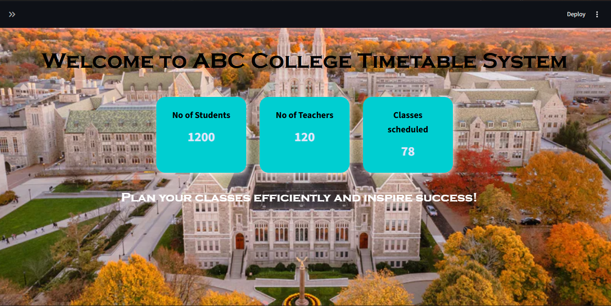
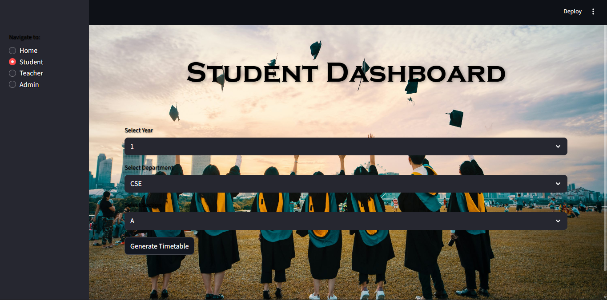
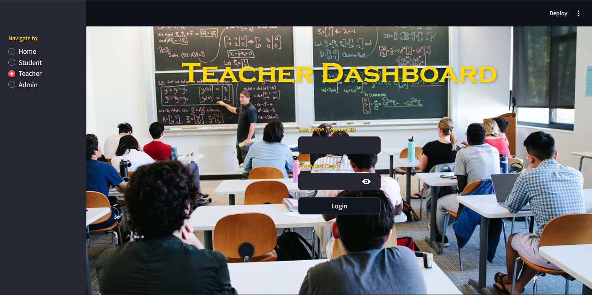
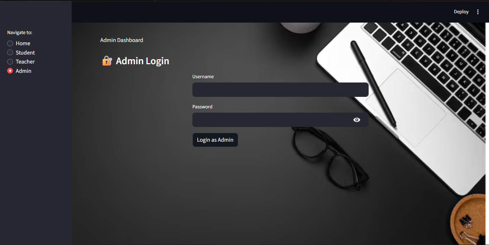
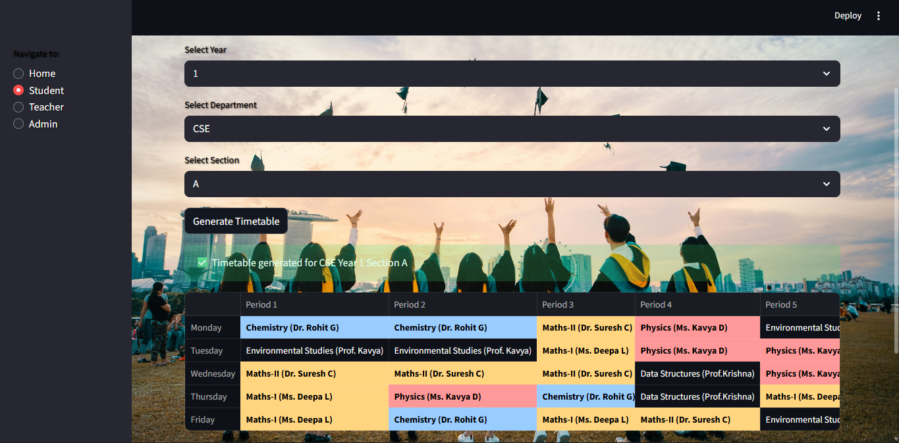
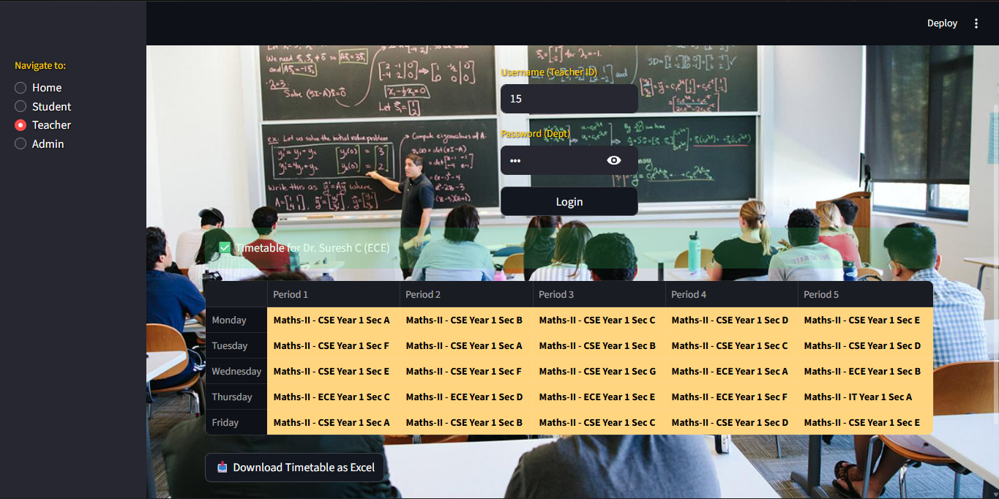
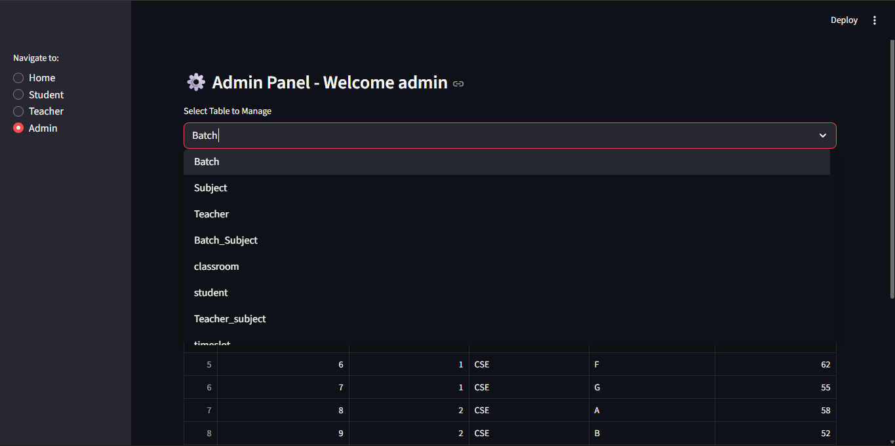
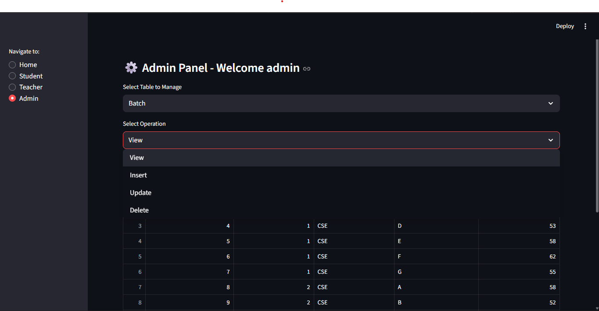

🗓️ Timetable Generator App

📌 Project Overview
The Timetable Generator App is a comprehensive Database Management System (DBMS) project developed to automate and optimize the process of creating academic timetables.  

Traditionally, timetables are prepared manually, which often results in:
- Teacher-class clashes  
- Overlapping classroom schedules  
- Inefficient subject allocation  
- A huge amount of wasted time and effort  

This project solves these issues by using a database-driven approach combined with Python automation. It ensures fair distribution of workloads, prevents clashes, and makes it easy for administrators to generate timetables within minutes.

 🎯 Objectives
- Automate timetable generation for schools/colleges.  
- Ensure no clashes between teacher, class, or classroom schedules.  
- Provide a user-friendly interface for admin to manage data.  
- Minimize human errors and save time in scheduling.  
- Showcase practical application of DBMS concepts such as ER modeling, normalization, and SQL queries.  

 🛠️ Tech Stack
- Programming Language: Python  
- Database: MySQL  
- Frontend: Python Web-based (Streamlit)  
- Backend: SQL + Python logic for timetable generation  
- Version Control: Git & GitHub  

 ✨ Features
- 🔄 Automatic Timetable Generation – Generate clash-free schedules instantly.  
- 🧑‍🏫 Teacher Management – Assign teachers to multiple subjects without overlaps.  
- 📚 Subject Allocation – Ensures subjects are fairly distributed across days and times.  
- 🏫 Classroom Scheduling – Prevents two classes from occupying the same room simultaneously.  
- 📊 Database-Driven Design – Data stored in MySQL for reliability and easy querying.  
- 🖥️ Admin Interface – User-friendly controls to add/update teachers, subjects, and classrooms.  

2. Set up Database

Open MySQL and create a database:

CREATE DATABASE timetable_db;

3. Import the schema:

source database/schema.sql;

4. Run the Application
    
   python app.py

📊 Database Design

ER Diagram

Entities: Teacher, Subject, Classroom, Batch, Timetable

Relationships:

A Teacher can teach multiple Subjects.

A Batch attends multiple Subjects.

A Classroom hosts multiple Batches, but not at the same time.

Normalization

Database normalized up to 3NF to avoid redundancy.

Example: Instead of repeating teacher details for each subject, separate tables are created for teachers, subjects, and their relationships.

 🖼️ Output Screenshots

 1. Home Page

 2. Student Dashboard

3. Teacher Dashboard

4. Admin Dashboard

5. Time Table generated for Students

6. Class schedule generated for Teachers

7. Admin panel table selection

8. Admin panel operation selection

📖 Example Use Case

Admin enters teacher details, subjects, and classrooms into the database.

Admin clicks Generate Timetable.

The app fetches data from MySQL, runs the scheduling algorithm, and outputs a conflict-free timetable.

The timetable can be viewed, updated, or exported.

👨‍💻 Contributors

Name: Thejas Krishna M
